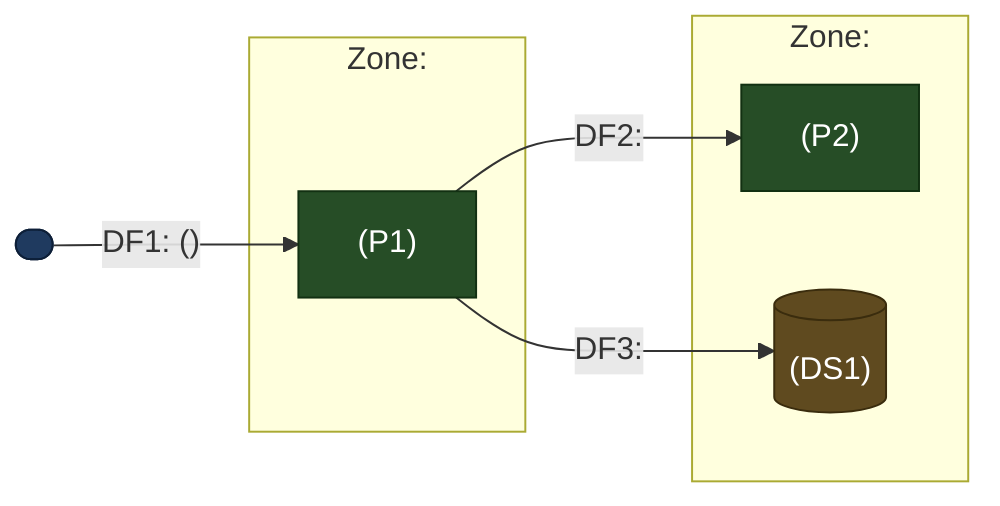

# Output Format Schemas

Structural templates for the deliverables. Fill placeholders (`<...>`) with the
real system. Keep IDs consistent with the conventions in SKILL.md. These define
format only; the threats, techniques, and controls come from your analysis and from
the ATT&CK/ATLAS catalogs, never from hardcoded examples.

## Data-flow diagram (Mermaid)

Processes, data stores, external entities, and flows. Draw trust boundaries as
`subgraph` blocks and **label each by its authorization profile** (who is
authorized to operate inside it), never by a trust level. Label flows with what
crosses and any protection. Mark LLM elements so ATLAS coverage is triggered.
Beyond roughly 12 elements, split into a context diagram plus per-boundary
sub-diagrams, keeping element IDs identical across them (see SKILL.md Phase 2).



Node shapes: `([text])` external entity, `[text]` process, `[(text)]` data store.
Every element ID must match the ledger.

## Threat actors

The adversaries the model is scored against, each with a stable `ADV#`. Likelihood
scores in the risk register cite the `ADV#` that realizes the threat.

| ID | Actor | Access | Capability | Motivation |
|----|-------|--------|------------|------------|
| `<ADV#>` | `<who>` | `<anonymous / authed user / insider / supply-chain / physical>` | `<opportunistic / funded+persistent / nation-state>` | `<fraud / data theft / disruption / sabotage / reputation>` |

## Assumptions register

Every premise the model rests on, each with a stable `A#`. Threats cite the `A#`
they depend on, so a wrong assumption visibly invalidates specific threats.

| ID | Assumption | Verified? | If wrong, affects |
|----|------------|-----------|-------------------|
| `<A#>` | `<stated premise>` | `<Confirmed / Unverified>` | `<threat refs whose validity depends on this>` |

## Threat ledger

One row per threat; the complete enumeration (whether or not it becomes a top
risk). `T-LLM-` rows appear only if an LLM element exists in the DFD.

| ID | Element | STRIDE / cat. | Threat (actor, element, effect) | MITRE technique(s) | L | I | Status |
|----|---------|---------------|---------------------------------|--------------------|---|---|--------|
| `<threat id>` | `<E/P/DS/DF id>` | `<STRIDE letter / LLM>` | `<specific threat>` | `<valid ATT&CK id(s); ATLAS id(s) if LLM>` | `<1-5>` | `<1-5>` | `<status>` |

MITRE column: ATT&CK IDs from `references/attack-techniques.md`; for LLM threats,
also ATLAS IDs from `references/atlas-techniques.md` (taxonomy rules per SKILL.md).
Status values: `Open`, `Mitigated`, `Accepted`, `Out-of-scope`, `Needs-info`. End
the ledger with a count breakdown (identified, open, mitigated, accepted,
out-of-scope).

## Risk scoring

Risk = Likelihood x Impact, each rated 1 to 5.
- Likelihood: 1 Rare, 2 Unlikely, 3 Possible, 4 Likely, 5 Almost certain. Anchor it
  to an `ADV#`: reachable by any anonymous or authenticated actor trends high;
  requiring privileged insider access, supply-chain position, or rare capability
  trends low.
- Impact: 1 Negligible, 2 Minor, 3 Moderate, 4 Major, 5 Severe.
- Bands: 1-4 Low, 5-9 Medium, 10-14 High, 15-25 Critical.

Give a one-line justification for each axis; the Likelihood line names the `ADV#`.

## Risk register

Scored threats promoted to tracked risks, ranked by score (Critical first).

| Risk ID | Source threat(s) | Description | L | I | Score | Severity | Owner | Mitigation(s) | Residual | Status |
|---------|------------------|-------------|---|---|-------|----------|-------|---------------|----------|--------|
| `<risk id>` | `<threat refs>` | `<risk>` | `<1-5>` | `<1-5>` | `<L*I>` | `<band>` | `<mitigation refs>` | `<residual>` | `<status>` |

## Mitigations

| Mitigation ID | Addresses | Control | Type (P/D/C) | Layer | Effort | Priority | Notes / residual |
|---------------|-----------|---------|--------------|-------|--------|----------|------------------|
| `<mitigation id>` | `<risk refs>` | `<control>` | `<Preventive/Detective/Corrective>` | `<Network/App/Data/Endpoint/Process>` | `<Low/Med/High>` | `<Quick win/Strategic/Accept>` | `<residual risk>` |

## Report skeleton

```markdown
# Threat Model: <System Name>
_Date, Author, Version, Inputs used (description / diagram / code@commit), LLM in DFD? Y/N_

## 1. Executive summary
System in a sentence; the top 3 risks in plain language; headline recommendations.

## 2. Scope and assumptions
In and out of scope; primary assets; the threat-actor table (ADV#); the assumptions
register (A#, verified?) and open questions; LLM present in the DFD? (determines
whether ATLAS is used).

## 3. Architecture and data-flow diagram
Mermaid DFD (trust boundaries labeled by authorization profile) plus brief prose on
each element and boundary. For larger systems, a context diagram plus per-boundary
sub-diagrams.

## 4. Threat ledger
Full STRIDE (plus LLM) enumeration table, ending with the count breakdown.

## 5. Risk register
Scored and ranked; Critical and High risks each explained in a sentence.

## 6. Remediations and roadmap
Mitigations table, then a prioritized roadmap (quick wins, then strategic, then
accept or monitor) with residual risk.

## 7. Traceability check
N threats identified, N risks registered, N High/Critical (all with at least one
mitigation), N unverified assumptions (A#). Flag any gaps, and call out unverified
load-bearing assumptions, since each can invalidate the threats that cite it.

## 8. Appendix
MITRE techniques used (ATT&CK, and ATLAS only if an LLM was present); the catalog
snapshot line(s) echoed from the reference files (so ID vintage is on record);
assumptions; methodology notes.
```

Keep the chain intact: mitigation to risk to threat to element to MITRE technique.
