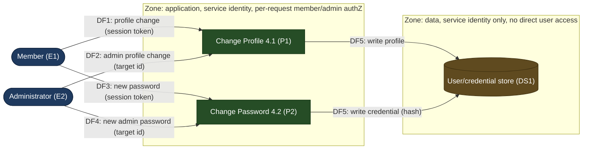

# Worked Example: Account Self-Service Module

One small system taken end to end, as a **format anchor**. The techniques, scores,
and controls below are illustrative; real ones come from your analysis and the
ATT&CK/ATLAS catalogs. This system is conventional software with **no LLM element**,
so ATLAS is not used (ATT&CK only). Source shape: a level-2 DFD in which the Member
and Administrator entities drive a **Change Profile (4.1)** and **Change Password
(4.2)** process.

---

## 1. Scope and decompose

**Boundary:** the profile/password self-service module only (not login or session
issuance, not the surrounding app).
**Primary assets:** password hashes (DS1), profile PII (DS1), integrity of admin
accounts.
**Actors:** Member (E1), Administrator (E2).
**Out of scope:** identity provider, network infrastructure.

### Threat actors

| ID | Actor | Access | Capability | Motivation |
|----|-------|--------|------------|------------|
| `ADV1` | Malicious member | Authenticated user | Opportunistic | Reach data or capability beyond own account |
| `ADV2` | Unauthenticated attacker | Anonymous (network path) | Opportunistic to funded | Intercept credentials, hijack accounts |

### Assumptions register

| ID | Assumption | Verified? | If wrong, affects |
|----|------------|-----------|-------------------|
| `A1` | Both processes persist to one shared user store `DS1` (not drawn in the source DFD; inferred). | Unverified | T-T-DS1-01, T-I-DS1-01 |
| `A2` | Members arrive with an established session; the "Login member valid" flow issues a bearer session token. | Unverified | T-S-P1-01, T-R-P1-01 |
| `A3` | Member and admin changes traverse the same processes, separated only by a role check. | Unverified | T-E-P2-01 |

### Elements

| ID | Type | Element |
|----|------|---------|
| `E1` | External entity | Member |
| `E2` | External entity | Administrator |
| `P1` | Process | Change Profile (4.1) |
| `P2` | Process | Change Password (4.2) |
| `DS1` | Data store | User/credential store (inferred, see A1) |
| `DF1` | Data flow | E1 to P1: profile change request (session token) |
| `DF2` | Data flow | E2 to P1: admin profile change (target user id) |
| `DF3` | Data flow | E1 to P2: new password (member) |
| `DF4` | Data flow | E2 to P2: new admin password (target user id) |
| `DF5` | Data flow | P1/P2 to DS1: write profile / credential |

**Trust boundaries:** members (E1) and administrators (E2) each sit in their own
authorization zone; P1/P2 run in the application zone; DS1 in the data zone. Every
E-to-P and P-to-DS1 crossing must authenticate the caller and authorize the target
of the change.

---

## 2. Data-flow diagram

No LLM element, so ATLAS is not used.

---

## 3. Threat ledger (excerpt)

Walking the applicable STRIDE letters per element; each applicable cell is a threat
or a justified **N/A** (the stopping rule).

| ID | Element | Cat. | Threat (actor, element, effect) | MITRE ATT&CK | L | I | Status |
|----|---------|------|---------------------------------|--------------|---|---|--------|
| `T-S-P1-01` | P1 / DF1 | S | Attacker replays a member session token captured on DF1 to change the victim's profile (depends A2). | T1539, T1550.004 | 3 | 3 | Open |
| `T-T-P1-01` | P1 | T | Member tampers the email field so account-recovery mail routes to attacker, enabling takeover. | T1098, T1078 | 3 | 4 | Open |
| `T-R-P1-01` | P1 | R | Member acts through a stolen session; the change is attributed to the victim, who cannot repudiate it, and there is no independent evidence (depends A2). | T1550.004 | 3 | 3 | Open |
| `T-I-P1-01` | P1 | I | IDOR: member sets another user's id on a DF2-style path and reads back that user's PII. | T1190, T1213 | 4 | 4 | Open |
| `T-D-P1-01` | P1 | D | **N/A**: profile writes are single, cheap, rate-limited at the gateway; no unbounded or amplifying work path. | (none) | (n/a) | (n/a) | N/A |
| `T-E-P2-01` | P2 | E | Member submits a change for an admin target id (DF4 shape) with no server-side authorization on the target, resetting an admin password (depends A3). | T1548, T1068 | 3 | 5 | Open |
| `T-I-P2-01` | P2 / DF3 | I | New password intercepted in transit on DF3 if transport is unprotected. | T1557 | 2 | 5 | Open |
| `T-T-DS1-01` | DS1 | T | A path that writes DS1 directly (outside P1/P2 validation) corrupts stored profile or credential data (depends A1). | T1078 | 2 | 4 | Open |
| `T-I-DS1-01` | DS1 | I | Read access to DS1 exposes password hashes for offline cracking (depends A1). | T1213, T1552 | 2 | 5 | Open |

_Count: 9 identified, 8 Open, 0 Mitigated, 0 Accepted, 1 N/A._

> Note on Repudiation mapping: absence of audit logging has no clean ATT&CK
> technique (ATT&CK catalogs adversary actions, not missing controls). Here the
> repudiation threat is mapped through the stolen-session mechanism (T1550.004) that
> makes attribution false. Where nothing fits, say so rather than forcing an ID.

---

## 4. Risk register (ranked)

Likelihood cites the `ADV#` behind each risk.

| Risk ID | Source | Adversary | Description | L | I | Score | Severity | Mitigation(s) | Residual |
|---------|--------|-----------|-------------|---|---|-------|----------|---------------|----------|
| `R-1` | T-E-P2-01 | ADV1 | Missing target-object authorization lets a member reset an admin password. | 3 | 5 | 15 | Critical | M-1, M-2 | Low |
| `R-2` | T-I-P1-01 | ADV1 | IDOR exposes other members' PII (any authed user, so high L). | 4 | 4 | 16 | Critical | M-1, M-3 | Low |
| `R-3` | T-I-DS1-01 | ADV2 | Credential-store read exposes password hashes (needs a foothold, so low L). | 2 | 5 | 10 | High | M-4, M-5 | Medium |
| `R-4` | T-I-P2-01 | ADV2 | Password intercepted in transit (needs network position, so low L). | 2 | 5 | 10 | High | M-6 | Low |
| `R-5` | T-T-P1-01, T-S-P1-01, T-R-P1-01 | ADV1/ADV2 | Session replay or profile tamper leading to account takeover. | 3 | 4 | 12 | High | M-6, M-7, M-8 | Low |

---

## 5. Mitigations

| ID | Addresses | Control | Type | Layer | Effort | Priority |
|----|-----------|---------|------|-------|--------|----------|
| `M-1` | R-1, R-2 | Enforce object-level authorization on the target id server-side for every change; deny by default. | Preventive | App | Med | Quick win |
| `M-2` | R-1 | Require step-up (re-auth) for admin-targeted or privilege-relevant changes. | Preventive | App | Med | Strategic |
| `M-3` | R-2 | Scope every read/write to the caller's own id; server-derived subject, never client-supplied. | Preventive | App | Low | Quick win |
| `M-4` | R-3 | Store passwords as salted memory-hard hashes (argon2/scrypt); segregate DS1 read access. | Preventive | Data | Med | Strategic |
| `M-5` | R-3 | Alert on bulk or anomalous reads of the credential store. | Detective | Data | Med | Strategic |
| `M-6` | R-4, R-5 | Enforce TLS on all E-to-P and P-to-DS1 flows; HSTS; reject downgrade. | Preventive | Network | Low | Quick win |
| `M-7` | R-5 | Bind session tokens to client context; short TTL; rotate on privilege change. | Preventive | App | Med | Strategic |
| `M-8` | R-5 | Tamper-evident, append-only audit log of profile/credential changes with actor, source, and before/after. | Detective | Process | Med | Strategic |

**Roadmap:** quick wins (M-1, M-3, M-6) close both Criticals and one High
immediately; strategic items (M-2, M-4, M-5, M-7, M-8) add depth and detection.

---

## 6. Traceability check

9 threats identified, 5 risks registered, 2 Critical plus 3 High, all 5 High and
Critical carry at least one mitigation, 3 unverified assumptions (A1 to A3). Chain
intact from mitigation to risk to threat to element to ATT&CK, and every Likelihood
cites an `ADV#`. The unverified assumptions are load-bearing: confirming A1 to A3
may add or retire threats.

_Appendix would echo: MITRE ATT&CK Enterprise v19 (April 2026), catalog snapshot
vendored 2026-09._
